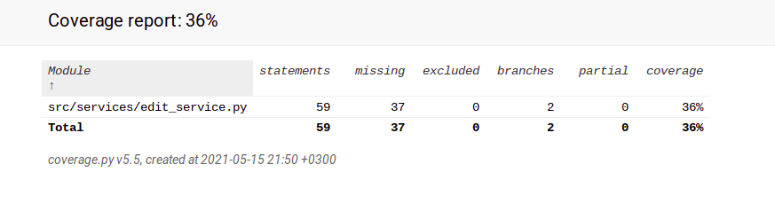

## Testausdokumentti

Testaus on jäänyt vajaaksi. Luokalle EditService on tehty yksi unittest-testi luokassa TestEditService. Kattavuus on 36%.

Komento 'poetry run invoke coverage-report' muodostaa kattavuusraposrtin kansioon 'htmlcov' tiedostoon 'index.html'.

